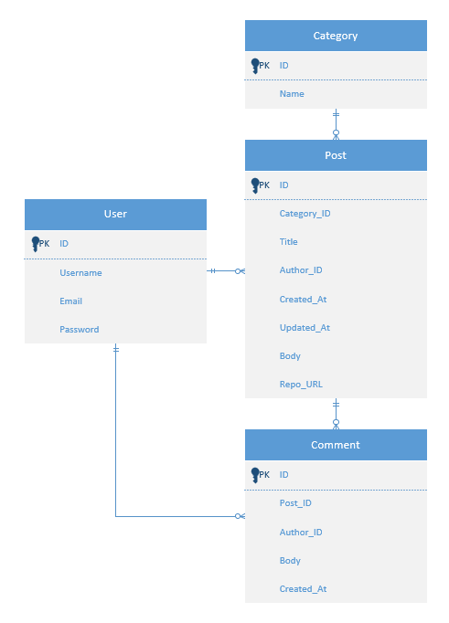
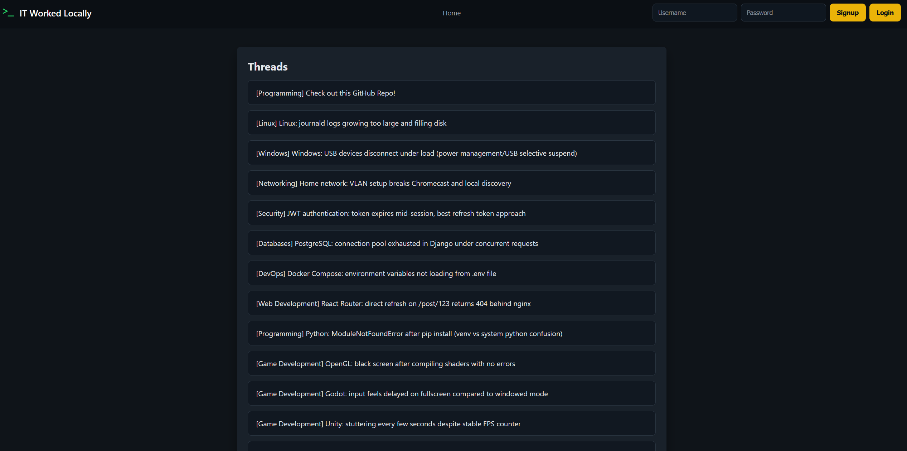
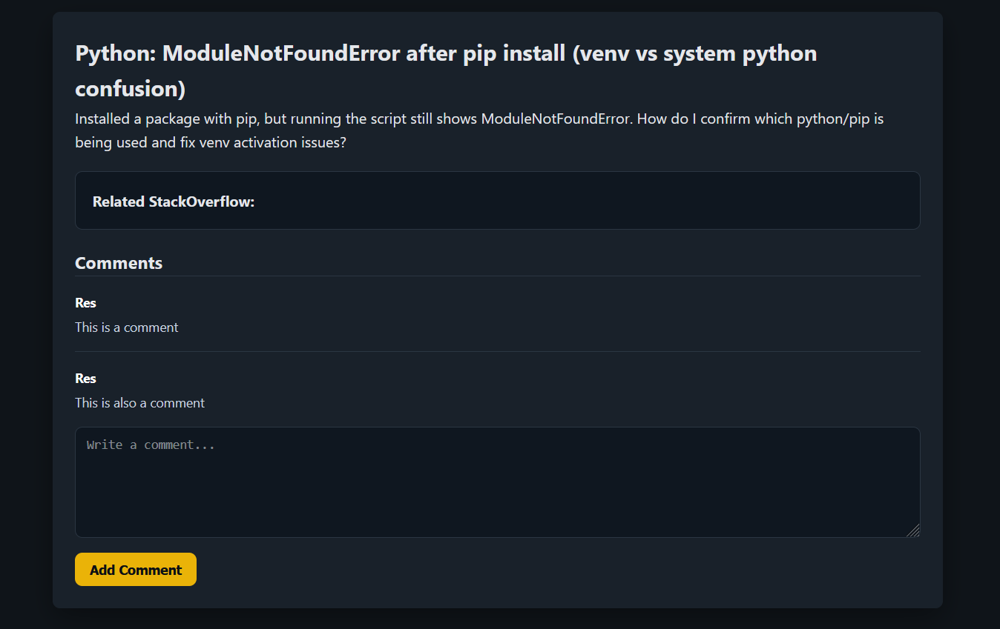
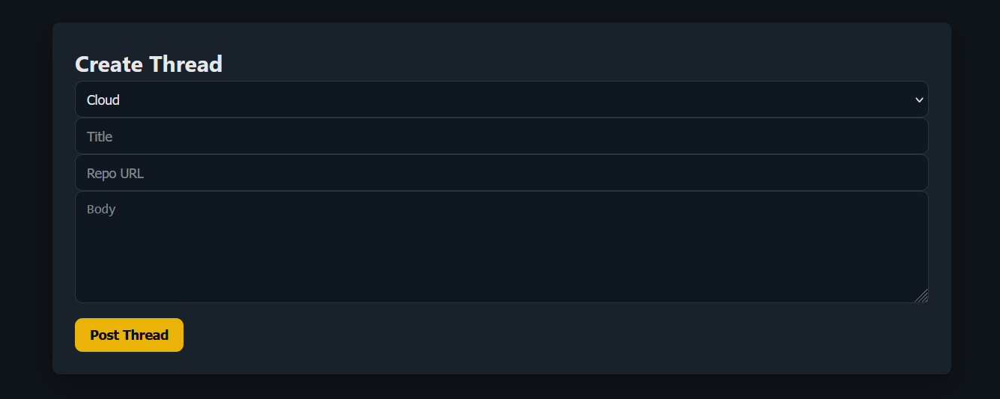
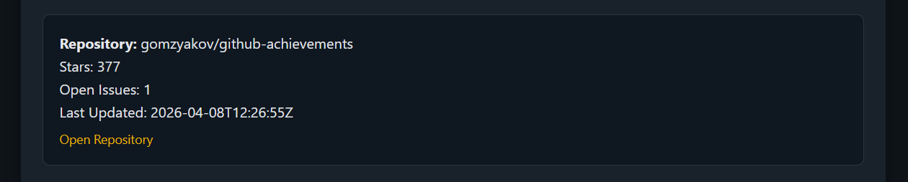
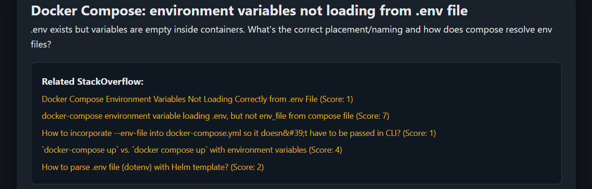

# IT Worked Locally

## Project Description and Purpose

IT Worked Locally is a technical forum built for developers to share deployment issues, fixes, setup notes, and troubleshooting discussions. Users can create posts in different categories, leave comments, and connect posts to GitHub repositories, issues, or pull requests.

The platform also pulls in GitHub repository information such as stars and last updated date, along with related Stack Overflow answers based on the thread title. This gives users more context while troubleshooting a problem.

The project is will be available locally at:

`http://127.0.0.1:81` or `http://localhost:81`

The deployed version will be available at:

`https://itworkedlocally.com`

## Features

### CRUD Operations

#### Create

Logged in users can create new posts inside categories.

Logged in users can also create comments on posts.

#### Read

Anyone can browse categories and posts.

Anonymous users can read forum content without needing an account.

#### Update

Post owners can edit a post title or body.

#### Delete

Post owners can delete posts.

### Authentication

Authentication is required for creating, editing, or deleting posts and comments.

Read only access is available for anonymous users.

### Third Party APIs

#### GitHub API

Users can attach a GitHub repository URL to a post.

The application fetches repository metadata such as repository name, stars, and last updated date.

#### Stack Overflow API

The application searches Stack Overflow using the post title.

Related questions and answers are shown to help users troubleshoot similar issues faster.

#### Joke API

The application fetches a random programming joke from JokeAPI.

If the API returns a setup and delivery, both are combined into one joke before displaying.

#### Quote API

The application fetches a random quote using a randomly selected author.

Authors are chosen from a predefined list of well known business leaders, inventors, writers, and entrepreneurs.

## Technologies Used

* React frontend
* Django backend
* Django REST Framework
* PostgreSQL
* Docker
* AWS EC2
* GitHub API
* Stack Overflow API
* Joke API
* Quote API

## Setup and Installation Instructions

### Clone the Repository

```bash
git clone https://github.com/DualNixSix/itworkedlocally.git
cd itworkedlocally
```

### Create .env file and paste in environment variables

```bash
touch .env
nano .env
```
or
```bash
touch .env
vi .env
```

### Full Project Initialization

```bash
./init.sh
```

This script will:

```text
Start Docker containers
Run migrations
Seed sample data
Create a superuser
```

### Reset the Entire Project

```bash
./reset.sh
```

### Seed Data Only

```bash
./seed.sh
```

### Stop Containers

```bash
./stop.sh
```
or
```bash
docker compose down
```

### Start Containers

```bash
./run.sh
```
or
```bash
docker compose up
```

## API Routes

```text
GET     /categories/
GET     /posts/
POST    /posts/
GET     /posts/:post_id/
PUT     /posts/:post_id/
DELETE  /posts/:post_id/
POST    /posts/:post_id/comments/
PUT     /comments/:comment_id/
DELETE  /comments/:comment_id/
```

## Schema Description

### Category

```text
id
name
```

### Post

```text
id
category_id
title
author_id
created_at
updated_at
body
repo_url
```

### Comment

```text
id
post_id
body
author_id
created_at
```

## ERD


## Screenshots

### Homepage with threads


### Post detail page with comments


### Create post form


### GitHub metadata section


### Related Stack Overflow results


### Random Jokes and Quotes


